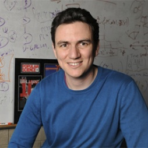



# Welcome to MODE Lab
-----

Machine learning and data-driven approaches are becoming very important in many areas.
MODE Lab at University of Washington is a research group working on exciting areas on
large-scale machine learning

## News
- The website initiates, after three years ..
